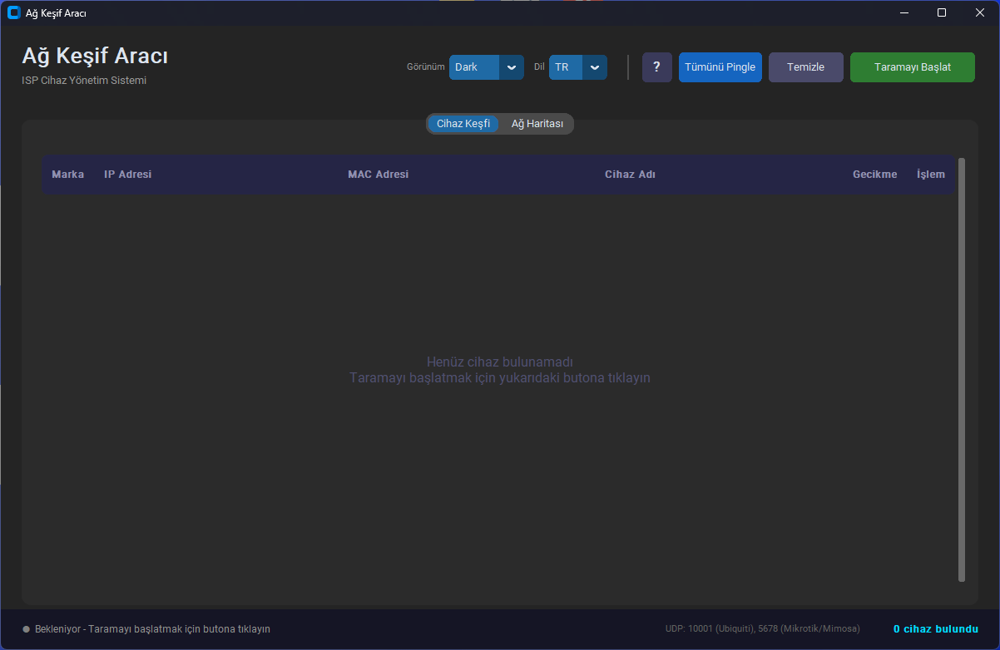
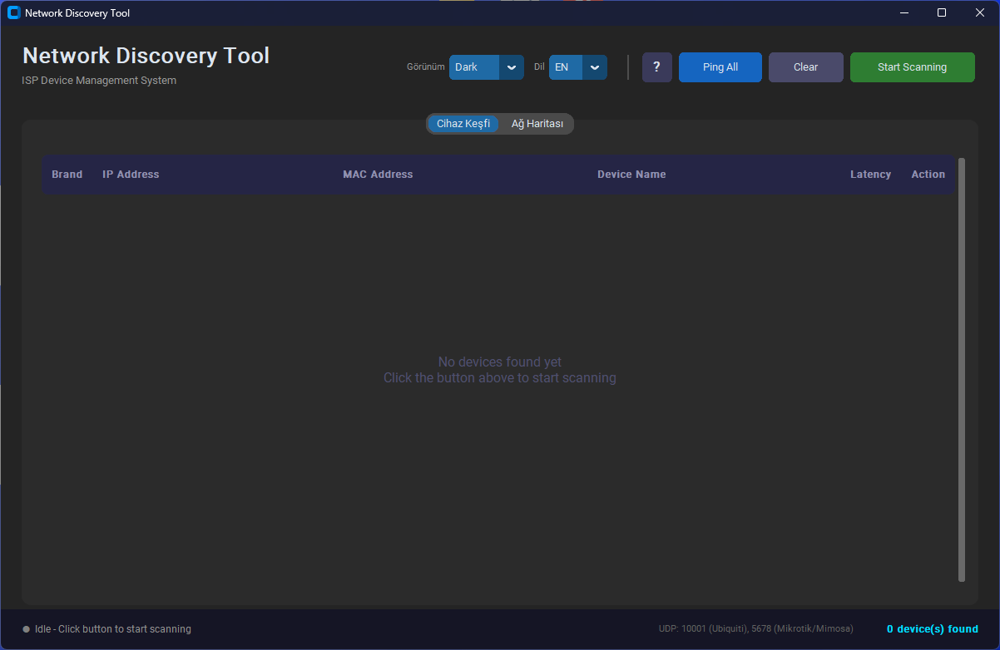
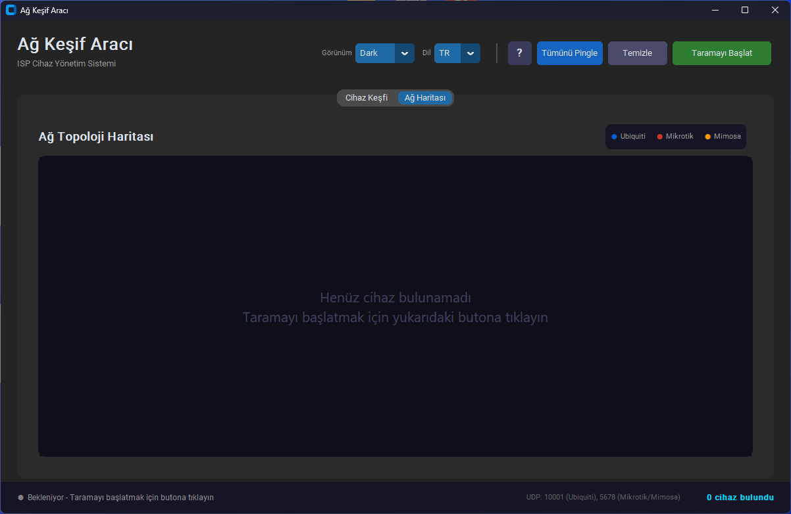
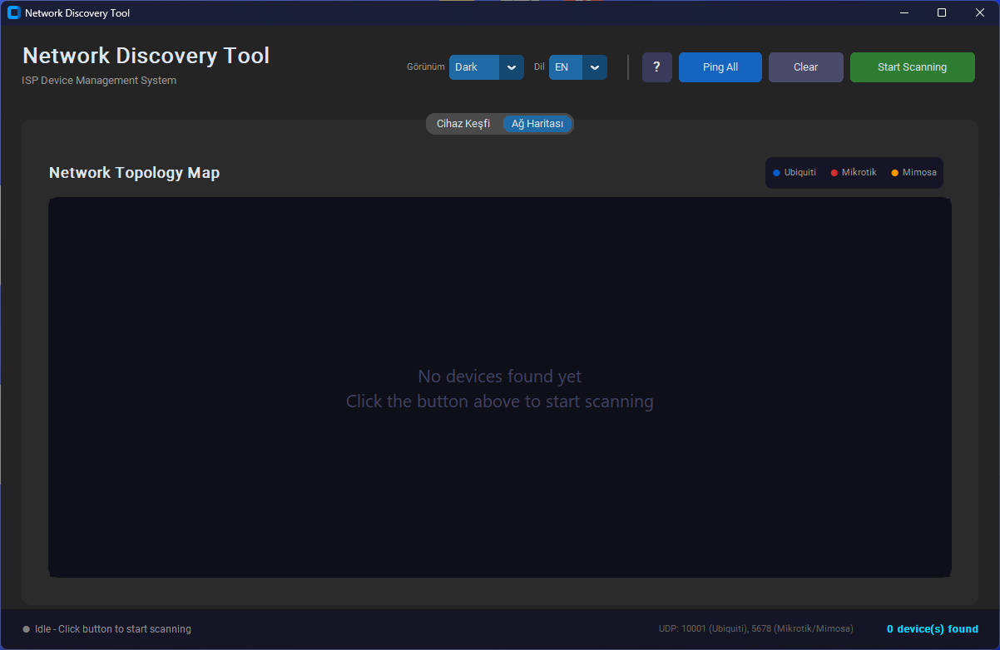

# Discovery Tool / Keşif Aracı


**[English]**  
A professional network discovery tool designed for ISP networks. It detects Ubiquiti, Mikrotik, Mimosa, and standard SNMP/Ping-enabled devices, visualizes the network topology, and provides real-time latency monitoring.

**[Türkçe]**  
ISP ağları için tasarlanmış profesyonel bir ağ keşif aracı. Ubiquiti, Mikrotik, Mimosa ve standart SNMP/Ping destekli cihazları tespit eder, ağ topolojisini görselleştirir ve gerçek zamanlı gecikme (ping) takibi sağlar.

---

## 🌟 Features / Özellikler

### English
- **Multi-Vendor Discovery**: Automatically detects Ubiquiti (UBNT), Mikrotik (MNDP), and Mimosa devices using native discovery protocols.
- **Network Mapping**: Visualizes devices in a dynamic topology map.
- **Latency Monitoring**: Real-time ping latency checks for all discovered devices.
- **Modern UI**: Built with CustomTkinter, supporting Dark/Light themes.
- **OUI Lookup**: Identifies device manufacturers via MAC address.
- **Multilingual**: Full support for English and Turkish.

### Türkçe
- **Çoklu Marka Keşfi**: Ubiquiti (UBNT), Mikrotik (MNDP) ve Mimosa cihazlarını kendi protokollerini kullanarak otomatik olarak algılar.
- **Ağ Haritalama**: Cihazları dinamik bir topoloji haritasında görselleştirir.
- **Gecikme Takibi**: Bulunan tüm cihazlar için gerçek zamanlı ping gecikme takibi.
- **Modern Arayüz**: CustomTkinter ile geliştirilmiş, Koyu/Açık tema desteği.
- **OUI Sorgulama**: MAC adresinden üretici tespiti.
- **Çoklu Dil**: Tam İngilizce ve Türkçe desteği.

---

## 🚀 Installation / Kurulum

### Requirements / Gereksinimler
- Python 3.8+
- [Npcap](https://npcap.com/) (Required for packet capture / Paket yakalama için gerekli)
- Administrator privileges / Yönetici hakları

### Setup / Kurulum
1. Clone the repository / Depoyu klonlayın:
   ```bash
   git clone https://github.com/yourusername/discovery-tool.git
   cd discovery-tool
   ```

2. Install dependencies / Bağımlılıkları yükleyin:
   ```bash
   pip install -r requirements.txt
   ```

---

## 📖 Usage / Kullanım

**Important:** This tool requires Administrator privileges to listen for network packets.  
**Önemli:** Bu araç, ağ paketlerini dinlemek için Yönetici hakları gerektirir.

Run the application / Uygulamayı çalıştırın:
```bash
python main.py
```

### Build .exe / .exe Oluşturma
To create a standalone executable / Tek bir çalıştırılabilir dosya oluşturmak için:
```bash
build_exe.bat
```
*(Requires PyInstaller / PyInstaller gerektirir)*

---

## 📷 Screenshots / Ekran Görüntüleri

### Dashboard / Gösterge Paneli



### Network Map / Ağ Haritası


---

## 📞 Contact / İletişim

**Project Owner / Proje Sahibi:** Yalçın ADIYAMAN  
**Email:** yalcinadiyamannn@gmail.com

---

## 📄 License / Lisans

This project is licensed under the MIT License - see the [LICENSE](LICENSE) file for details.  
Bu proje MIT Lisansı altında lisanslanmıştır - detaylar için [LICENSE](LICENSE) dosyasına bakın.
